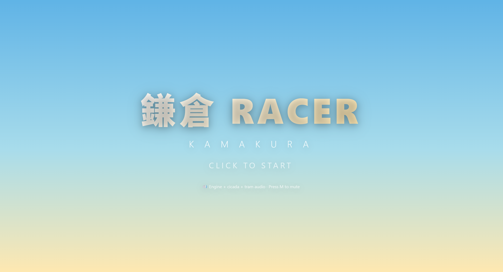
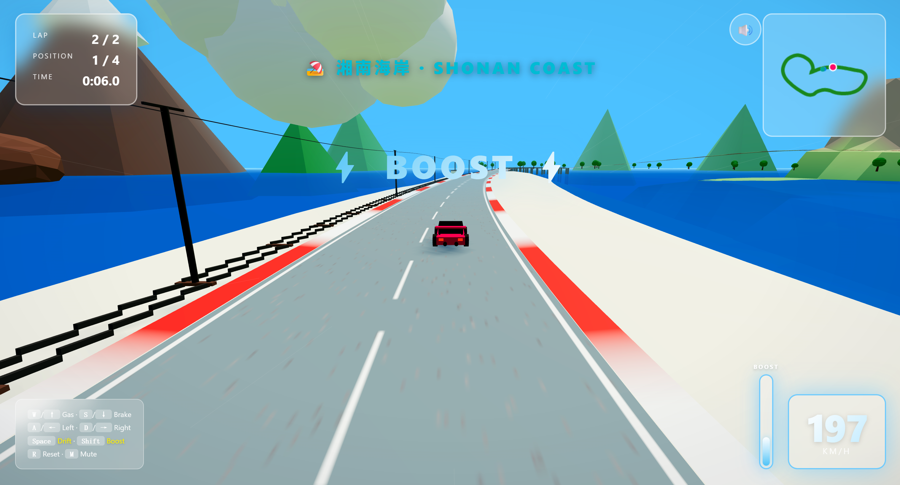
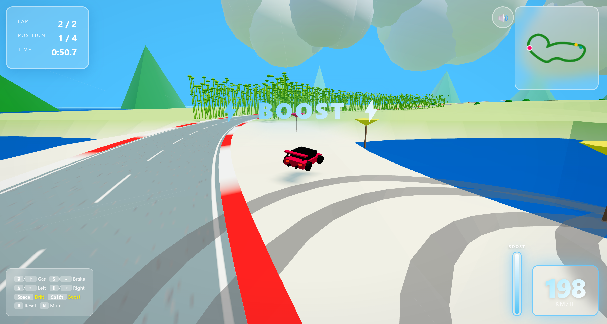

<div align="center">

# 🏁 Kamakura RACER

**A single-file 3D arcade racer through Kamakura & the Shonan Coast — built with Three.js.**

Drift past seaside temples, dodge the Enoden tram, and burn nitro down a hand-sculpted track from the town of Kamakura to the bamboo groves and back.

### ▶️ [**Play it now → the-unknown-01.github.io/Kamakura-RACER**](https://the-unknown-01.github.io/Kamakura-RACER/)

[](https://the-unknown-01.github.io/Kamakura-RACER/)
[](https://opensource.org/licenses/MIT)
[](https://threejs.org/)
[](./)
[](./CONTRIBUTING.md)

</div>

---

## 📸 Screenshots

> _Add your own captures here — overlay, race, drift, and the Fuji backdrop all make great shots._

| Start Screen | Racing | Drifting |
| :---: | :---: | :---: |
|  |  |  |

---

## ✨ Features

- **One HTML file, zero build step.** Clone, open `index.html`, drive.
- **Hand-crafted Catmull-Rom circuit** spanning 11 distinct zones — town, Shonan coast, river bridges, coastal hills, scenic overlook, beach road, bamboo grove, and a torii-lined shrine finale.
- **Drift & Boost mechanics** — hold `Space` to break traction and bank drift score; build nitro by drifting, then dump it with `Shift` for flame-spitting acceleration.
- **Three AI rivals** with rubber-band-free, look-ahead steering so you always have someone to chase.
- **Environmental storytelling** — procedural Japanese houses, veranda shoji screens, torii gates, bamboo stalks, beach umbrellas, an Enoden tram line with overhead catenary, Mt. Fuji and Enoshima on the horizon.
- **Cliff & bridge hazards** — leave the road on the hills or bridges and you'll fall. Into the ocean. With sound.
- **Full procedural audio** — Web Audio synthesis for engine, cicadas, wind chimes, and the Enoden tram bell. No audio assets required.
- **Live HUD** — speedometer, lap counter, position, timer, boost meter, drift indicator, minimap, and zone banners that announce where you are.

---

## 🎮 Controls

| Action | Key |
| :--- | :--- |
| Accelerate | `W` / `↑` |
| Brake / Reverse | `S` / `↓` |
| Steer Left | `A` / `←` |
| Steer Right | `D` / `→` |
| Drift (handbrake) | `Space` |
| Nitro Boost | `Shift` |
| Reset to track | `R` |
| Mute / Unmute | `M` |

> **Tip:** Nitro only activates while you're accelerating. Build it up by drifting — the meter on the right tells you when you're full.

---

## 🚀 Play Online

The game is deployed on GitHub Pages — no install required:

**👉 https://the-unknown-01.github.io/Kamakura-RACER/**

Click anywhere on the start screen to enable audio (browsers block Web Audio until the first user gesture), then hold `W` and go.

---

## 💻 Run Locally

### Option 1 — Just open it
Download or clone the repo and open `index.html` in any modern browser (Chrome, Edge, Firefox, Safari).

```bash
git clone https://github.com/the-unknown-01/Kamakura-RACER.git
cd Kamakura-RACER
open index.html        # macOS
# start index.html     # Windows
# xdg-open index.html  # Linux
```

### Option 2 — Serve locally
Some browsers gate Web Audio until the page is served over HTTP. If audio doesn't fire up, run a static server:

```bash
python3 -m http.server 8000
# or
npx serve .
```

Then visit <http://localhost:8000>.

### Requirements
- A GPU that supports WebGL2
- A browser with the Web Audio API (any modern browser)
- No Node, no bundler, no npm install

---

## 📦 Deployment

Hosted on **GitHub Pages** from the `main` branch, root folder.

To deploy your own fork:

1. Push your changes to `main`
2. Go to **Settings → Pages**
3. Set **Source** to `Deploy from a branch`
4. Choose **`main`** / **`/ (root)`** and save
5. Your build will be live at `https://<your-username>.github.io/Kamakura-RACER/` within a minute

No CI, no build artifacts — Pages serves `index.html` directly.

---

## 🗂 Project Structure

```
Kamakura-RACER/
├── index.html          # The whole game — markup, styles, and script
├── README.md
├── LICENSE
└── docs/
    └── screenshot-*.png
```

Inside `index.html` the script is organized into clearly commented sections:

| § | Section | What it does |
| :- | :--- | :--- |
| 1 | Core Setup | Scene, camera, renderer, lights |
| 2 | Track | Zone definitions, Catmull-Rom curve, progress lookup |
| 3 | Track Mesh | Road, curbs, finish line |
| 4 | Ocean | Vertex-animated water |
| 5 | Enoden Tram Line | Rails, ties, poles, catenary, tram model |
| 6 | Ground | Height-mapped terrain with per-zone coloring |
| 7 | Bridges | Pillars and railings over the deadly zones |
| 8 | Mt. Fuji & Enoshima | Distant landmarks |
| 9 | Cultural Elements | Houses, torii, bamboo, umbrellas, summer trees |
| 10 | Clouds | Billboard-free puff clusters |
| 11–12 | Car & Particles | Player/AI cars, tire smoke, speed lines, skid marks |
| 13 | Audio Engine | Web Audio synthesis graph |
| 14–19 | Simulation | Car state, collisions, input, physics, AI |
| 20–25 | Presentation | Camera, minimap, HUD, countdown, grid |
| 26 | Main Loop | The `requestAnimationFrame` tick |

---

## 🛠 Tech Stack

- **[Three.js](https://threejs.org/) r160** (loaded via jsDelivr CDN)
- **Web Audio API** — every sound is synthesized at runtime
- **Canvas 2D** — procedurally generated road texture and minimap
- **Vanilla JS + CSS** — no framework, no bundler
- **GitHub Pages** — zero-config static hosting

---

## 🧭 Roadmap

Ideas welcome — open an issue if any of these sound fun.

- [ ] Time-trial ghost replay
- [ ] More circuits (Enoshima loop, Kamakura station sprint)
- [ ] Mobile touch controls
- [ ] Bike / kei-car alternate vehicles
- [ ] Weather — rain, dusk, hanabi night mode
- [ ] Local leaderboard via `localStorage`

---

## 🤝 Contributing

Contributions, bug reports, and screenshots of your best drift lines are all welcome.

1. Fork the repo
2. Create a branch: `git checkout -b feat/your-feature`
3. Commit: `git commit -m "feat: add rain weather"`
4. Push and open a Pull Request

Please keep PRs scoped — this project deliberately stays single-file and dependency-free, so large refactors will be discussed before merging.

---

## 📜 License

Released under the [MIT License](./LICENSE). Do whatever you like — just keep the copyright notice.

---

## 🙏 Acknowledgements

- The **Enoden** (江ノ島電鉄) for being the most photogenic tram line in Japan
- **Shonan** for the light that made every color in this scene look right
- The **Three.js** community for keeping 3D on the web fun
- Every cicada that ever screamed through a Kamakura summer

<div align="center">

**鎌倉へようこそ。 Let's race.**

</div>